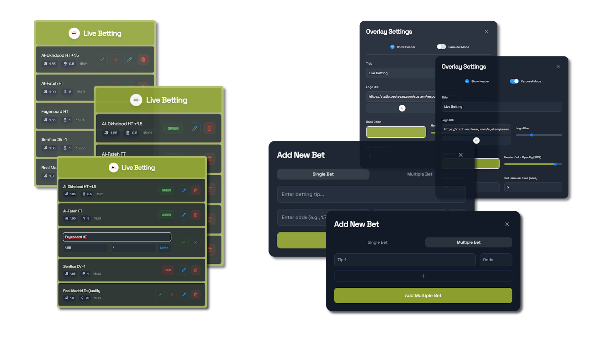

# Betting Tips Overlay for Streamers

This React-based overlay allows streamers to manage and display betting tips directly on their streams. It includes both single and multiple bet options, with real-time status updates.

---



---

## Features

- **Add and manage bets**: Easily add single or multiple bets with custom odds and tips.
- **Live status updates**: Update bet status to "green" (win) or "red" (lose) during streams.
- **Customizable appearance**: Adjust colors and opacity for a personalized design.

## How It Works

1. **Add Tips**: Use the modal to add single or multiple betting tips.
2. **Manage Bets**: Edit or remove bets, update odds, and change bet status during the stream.
3. **Display on Stream**: The tips box is styled for stream use, with real-time updates for your audience.

## Installation

1. Clone the repository:
   ```bash
   git clone https://github.com/maseurodrigo/TipStream.git
   cd TipStream
   ```
2. Install dependencies:
   ```bash
   npm install
   ```
3. Start the app:
   ```bash
   npm run start
   ```

4. Use the overlay URL in your streaming software.

## Configuration

- **Color Customization**: Modify the `baseColor` and opacity for a personalized look.
- **Logo**: Set your logo by providing an image URL in the `logoUrl` prop.

## Commands & Actions

- **Add a Bet**: Click the "+" button to add a tip, either as a single or multiple bet.
- **Edit Bets**: Streamers can edit bets directly during the stream.
- **Change Bet Status**: Update bet status (green/red) by clicking on the respective status button.
